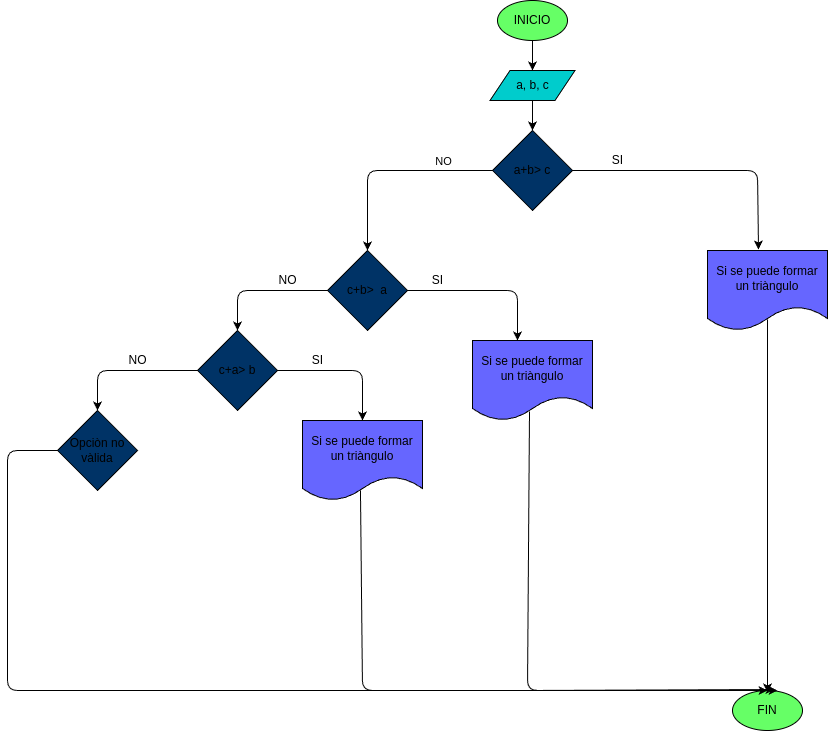

# Quiz instrucciones condicionales

### Realice el análisis, diseño y construcción para resolver el siguiente problema:

Dados tres números a, b y c, correspondientes a la longitud de los lados de una figura geométrica, determinar si pueden formar los lados de un triángulo.

### Input 
a,b,c: nùmero de cada longitud del triàngulo

### processing 
si a+b>c  se puede formar el triàngulo
si b+c>a se puede formar el triàngulo
si c+a>b se puede formar el triàngulo 
De lo contrario no se podrà formar un triàngulo

 ### output
 se puede o no se puede formar el triàngulo

## DISEÑO

### Diagrama de flujo

### Construcciòn 